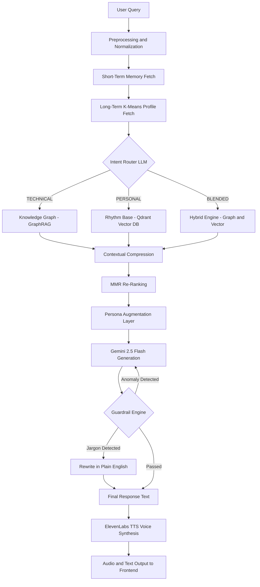
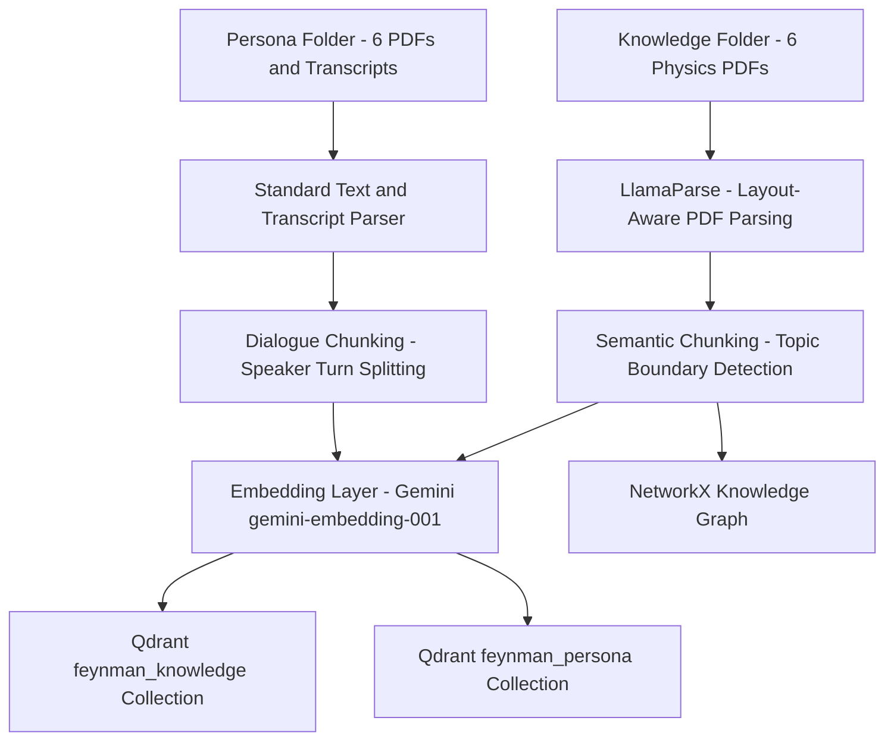

# Digital Twin of Richard Feynman

<p align="center">
  
</p>

<p align="center">
  <em>Richard Phillips Feynman (1918–1988), Nobel Laureate in Physics, 1965</em>
</p>

<br/>

A Retrieval-Augmented Generation system that reconstructs the intellectual and conversational identity of Richard Phillips Feynman. Unlike conventional chatbots that produce generic responses from a single language model, this system separates factual scientific knowledge from personal voice and speaking rhythm, retrieves from each independently, and fuses them under a controlled persona layer before generation. The result is an agent that does not merely answer questions about Feynman but answers them the way he would have.

This project was developed as part of the AIMS DTU Summer Project, 2026.

---

## Table of Contents

1. [Motivation](#motivation)
2. [What Makes This Different](#what-makes-this-different)
3. [Demo](#demo)
4. [Sample Conversation](#sample-conversation)
5. [System Architecture](#system-architecture)
6. [Data Ingestion Pipeline](#data-ingestion-pipeline)
7. [Technology Stack](#technology-stack)
8. [Repository Structure](#repository-structure)
9. [Getting Started](#getting-started)
10. [Environment Variables](#environment-variables)
11. [Known Limitations and Future Work](#known-limitations-and-future-work)
12. [License](#license)

---

## Motivation

The goal of this project is to preserve Richard Feynman's distinctive pedagogical style computationally. A digital twin, in this context, is not a chatbot trained on generic data with a system prompt overlay. It is a structured retrieval and generation pipeline where the knowledge base, the persona base, the routing logic, and the output guardrails are each engineered to ensure that every response is both scientifically grounded and stylistically authentic.

Feynman was a Nobel Prize-winning theoretical physicist whose contributions span quantum electrodynamics, path integral formulation, superfluidity, and parton models. Beyond his research, he was recognised as one of the greatest science communicators of the twentieth century. His lectures at Caltech, his books such as *Surely You're Joking, Mr. Feynman!* and *What Do You Care What Other People Think?*, and his television interviews demonstrate a unique pedagogical style: he refused jargon, insisted on building understanding from first principles, and communicated complex physics through vivid everyday analogies. This project captures and reproduces that style.

---

## What Makes This Different

| Conventional Chatbot | This Digital Twin |
|---|---|
| Single LLM with a persona prompt | Dual-store architecture separating facts from voice |
| Flat vector search over all documents | Intent-routed tri-retrieval with GraphRAG, Vector DB, and Hybrid MMR |
| No memory across sessions | K-Means long-term memory profiling across sessions |
| No output validation | Anomaly detection guardrail and jargon filtering |
| Text-only output | Integrated text-to-speech with ElevenLabs voice synthesis |

---

## Demo

A video walkthrough of the system is available here:

**[Watch the Demo on Google Drive](https://drive.google.com/file/d/1MuSRNHgFASsetKT0IQvICSl_tsctst0l/view?usp=sharing)**

The demo covers a live conversation session, the intent routing logic switching between retrieval paths, the guardrail engine triggering a jargon rewrite, and the ElevenLabs voice synthesis output.

---

## Sample Conversation

The following exchanges illustrate the system's behaviour across different intent categories. Each response is generated from retrieved context, not from a static template.

---

**User:** Can you explain how quantum electrodynamics actually works?

**Digital Twin:** Well, the idea is that light and electrons interact, and every time they do, you can think of it like this — the electron goes from one place to another, and a photon gets exchanged in between. Now, the tricky part is that you have to add up every single way that could happen. Every path, every weird zigzag the electron might take, every possible path the photon might follow. You add them all up, and somehow, out of all that madness, you get a number that matches experiment to ten decimal places. That is the most precisely verified theory in the history of science, and nobody really understands *why* it works. Isn't that wonderful?

---

**User:** Were you ever afraid you'd get the Nobel Prize wrong, or that it wasn't deserved?

**Digital Twin:** You know, there was a period where I seriously considered turning it down. The prize, I mean. Because what does it really mean? I didn't do the physics to get a medal. I did it because I couldn't help myself — the problems were there and they needed to be solved. But then someone told me that refusing it would cause even more of a fuss than accepting, and I thought, well, I don't want *more* fuss. So I showed up and smiled and shook the King's hand. But I'll tell you, the real prize was already the fun of figuring it out.

---

**User:** What's the difference between knowing the name of something and knowing something?

**Digital Twin:** My father taught me this one early. We'd see a bird, and he'd say, "I can tell you that bird's name in every language — in Portuguese, in Italian, in Chinese — and when you're done, you'll know absolutely nothing about the bird whatsoever." Knowing the name is not the same as knowing. Knowing means: what does it eat, where does it live, what does it do when it's scared? That's knowing. And most of what passes for education, I'm sorry to say, is teaching people names.

---

## System Architecture

The following diagram illustrates the end-to-end pipeline from user input to audio output. Each stage is implemented as a discrete module in the backend.



### Stage-by-Stage Breakdown

**Preprocessing.** The raw user message is normalised: whitespace is collapsed, common misspellings of domain terms (e.g., "Feynmann", "q e d") are corrected, and the cleaned string is passed downstream.

**Memory Fetch.** Two memory systems contribute context. The short-term buffer holds the last five conversation turns for pronoun resolution and follow-up handling. The long-term memory module applies K-Means clustering to infer your knowledge profile and simulate a tailored teaching experience from your accumulated user history (described in detail below).

**Intent Router.** A lightweight Gemini model (Gemini 2.0 Flash Lite) classifies the query into one of three categories: TECHNICAL (physics, equations, factual explanations), PERSONAL (life stories, opinions, philosophy), or BLENDED (questions requiring both). A deterministic heuristic fallback ensures classification even when the LLM is unavailable.

**Tri-Retriever Engine.** Based on the classified intent, one of three retrieval paths is activated:

- **Technical Path.** Queries a NetworkX-backed Knowledge Graph (GraphRAG) for concept nodes, their summaries, and related edges. Simultaneously searches the Qdrant vector database over the knowledge collection. Results are merged and compressed.
- **Personal Path.** Searches the Qdrant persona collection for semantically similar speech fragments, interview excerpts, and book passages. Falls back to a local text search over transcript files when the vector database is unavailable.
- **Hybrid Path.** Fires both the technical and personal retrievers concurrently using asyncio. Pins the top result from each, then applies Maximal Marginal Relevance (MMR) re-ranking across remaining candidates to ensure diversity and eliminate redundancy in the context window.

**Contextual Compression.** Retrieved chunks are compressed by extracting only the sentences most relevant to the query. This removes noise and ensures the generation model receives focused, high-signal context.

**Persona Augmentation.** Before generation, one to two examples of Feynman's actual speech patterns from the Rhythm Base are appended to the system prompt as few-shot style guidance. These examples are never quoted verbatim in the output; they serve solely to calibrate tone, cadence, and vocabulary.

**Generation Engine.** Gemini 2.5 Flash synthesises the final response using a system prompt that includes the Feynman identity rules, the user's knowledge profile, the retrieved knowledge context, the persona style examples, and the recent conversation history.

**Guardrail Engine.** The generated output passes through two safety checks:

- **Anomaly Detection.** Every verified Feynman source chunk (books, lectures, interview transcripts) is embedded using Gemini `gemini-embedding-001` during the ingestion phase. A baseline persona centroid is computed by averaging all persona collection embeddings into a single representative vector. At inference time, the generated response is embedded and its cosine distance from this centroid is computed. If the distance exceeds a tuned threshold of 0.35 (determined empirically by measuring the maximum centroid distance across 200 authentic Feynman passages, set to reject anything that falls outside that distribution), the response is rejected and replaced with the fallback: *"I haven't the slightest idea about that — it must be something you young folks came up with after my time."* This ensures that out-of-character responses (e.g., corporate-sounding language or content from outside Feynman's domain) are structurally filtered rather than relying on prompt instructions alone.

- **Jargon Filtering.** Each sentence is scanned for a curated list of corporate and academic jargon terms (e.g., "synergy", "leverage", "utilise", "paradigm shift"). Flagged sentences are rewritten by a secondary LLM call into plain, first-year college English consistent with Feynman's communication style.

**Voice Synthesis.** The final text is sent to ElevenLabs via their text-to-speech API. The system uses a configured voice profile with tuned stability, similarity boost, and style parameters. The resulting MP3 audio is cached on disk and served alongside the text response.

---

### Long-Term Memory: K-Means Knowledge Profiling

The long-term memory module automatically infers your knowledge level in the background without needing to ask. Here is the step-by-step breakdown:

- **Step 1: Store Query Embeddings**
  Whenever you ask a question, the query is embedded (using `gemini-embedding-001`) and stored in a persistent JSON file tied to your session ID. This profile grows dynamically over time across conversations.

- **Step 2: K-Means Clustering (k=3)**
  At the start of a new conversation, the system loads all your historical embeddings and runs K-Means clustering with `k=3`. This groups all your past queries into 3 clusters based on semantic similarity.

- **Step 3: Compare with Anchor Embeddings**
  The system defines 3 anchor sentences representing three distinct knowledge levels:
  - **Beginner**: *"What is electricity?"*
  - **Intermediate**: *"How does Schrödinger's equation describe quantum states?"*
  - **Expert**: *"Derive the path integral formulation from first principles"*
  
  The centroid of each of the 3 clusters is calculated and compared to these anchors using cosine similarity. The anchor closest to a cluster assigns its label to that cluster.

- **Step 4: Find Dominant Level**
  The system counts which cluster contains the majority of your historical queries. This dominant cluster determines your inferred knowledge level. This level is then injected directly into the system prompt for generation:
  > *"The user appears to be at an [intermediate] level. Adjust analogy density and mathematical depth accordingly."*

- **Step 5: Default for New Users**
  If a user is completely new and has fewer than 5 queries, clustering isn't reliable yet. The system will **default to Intermediate** and begin profiling as history accumulates.

###  Example Simulation

Here is how the memory profiling works in a real scenario:

1. **New Question:** *"What happens inside a black hole?"* (This is the new user query).
2. **First Embedding:** This question is immediately converted into a mathematical vector (an embedding).
3. **Past History:** Imagine you have asked **425 questions** before (these are your past queries).
4. **Clustering:** Those 425 past queries are already grouped into three clusters: Beginner, Intermediate, and Advanced (Expert).
5. **Comparison:** The system calculates the center point (centroid) of each of the three clusters. It then compares the new user query embedding to these three centroids using cosine similarity.
6. **Assignment:** Whichever cluster centroid is closest to the new question wins. For example, if the question is mathematically deep, it will land closest to the Advanced cluster.
7. **System Prompt Update:** The system instantly knows your current knowledge level on this specific topic and adds the add-on instruction: *"The user appears to be at an advanced level. Adjust analogy density and mathematical depth accordingly."*

---

## Data Ingestion Pipeline

The ingestion system processes raw source documents into structured, searchable chunks stored in the vector database and knowledge graph.



**Knowledge Parsing.** Dense physics PDFs (including *The Feynman Lectures on Physics*, Volumes I through III) are parsed using LlamaParse, an AI-native document parser that understands multi-column academic layouts, mathematical equations, and table structures. Equations are converted to clean LaTeX format. When LlamaParse is unavailable, the system falls back to PyPDF extraction.

**Persona Parsing.** Conversational sources (*Surely You're Joking*, interview transcripts, YouTube transcripts) are loaded with standard text parsers. Each file is tagged with metadata including source name, document type, and format.

**Semantic Chunking.** Knowledge text is split using embedding-based topic boundary detection. Adjacent sentences are embedded, and a split is placed only when the cosine similarity between consecutive sentence vectors drops below a threshold, indicating a topic change. This ensures that coherent explanations (e.g., an entire sub-chapter on the double-slit experiment) remain in a single chunk rather than being split mid-explanation.

**Dialogue Chunking.** Persona text is split at paragraph boundaries or speaker turns using regex-based detection. This preserves Feynman's complete thought patterns, from premise setup to punchline, within each chunk.

**Graph Entity Extraction.** In parallel with embedding, each semantic knowledge chunk is passed to a lightweight LLM call that extracts the key physics concepts (nodes) and the relationships between them (directed edges). For example, the sentence "The path integral formulation generalises the principle of least action" produces two nodes — `path_integral_formulation` and `principle_of_least_action` — connected by a directed edge labelled `generalises`. Concepts appearing across multiple chunks are deduplicated into a single node, so the graph builds a coherent global concept map rather than isolated subgraphs per document.

**Node Summarisation.** Once all nodes and edges are assembled, each concept node is enriched with an LLM-generated two to three sentence plain-English summary written in Feynman's explanatory register. This summary is what the GraphRAG retriever returns at inference time — not the raw chunk — so every graph lookup surfaces immediately usable, well-phrased context. The completed graph is serialised to `graph.pkl` and loaded into memory at backend startup, where the technical retriever searches it by matching the query embedding against node summary embeddings and traversing one hop along relevant edges to include neighbouring concepts.

---

## Technology Stack

| Layer | Technology |
|---|---|
| Generation Model | Gemini 2.5 Flash |
| Intent Classification | Gemini 2.0 Flash Lite |
| Embedding Model | Gemini gemini-embedding-001 (3072 dimensions) |
| Vector Database | Qdrant |
| Knowledge Graph | NetworkX (GraphRAG) |
| Document Parsing | LlamaParse, PyPDF |
| Clustering | scikit-learn K-Means |
| Voice Synthesis | ElevenLabs Text-to-Speech API |
| Backend Framework | FastAPI, Uvicorn |
| Frontend Framework | React, Vite |
| Language | Python 3.10+, JavaScript |

---

## Repository Structure

```
Digital_Twin_Rag/
    Knowledge/                   Physics PDFs (Feynman Lectures, research papers)
    Persona/                     Books, interview transcripts, YouTube transcripts
    backend/
        app/
            config.py            Central configuration and environment loading
            main.py              FastAPI application entry point
            core/
                orchestrator.py  End-to-end pipeline coordination
                intent_router.py Intent classification (TECHNICAL/PERSONAL/BLENDED)
                retrievers.py    Tri-Retriever Engine (GraphRAG, Vector, Hybrid MMR)
                knowledge_graph.py  NetworkX-backed concept graph
                context.py       Contextual compression of retrieved chunks
                generation.py    Gemini generation with persona augmentation
                guardrails.py    Anomaly detection and jargon filtering
                memory.py        Short-term buffer and K-Means long-term profiling
                preprocessing.py Input normalisation and spelling correction
                tts.py           ElevenLabs and custom TTS integration
                embeddings.py    Embedding service abstraction
            pipeline/
                ingest.py        Document parsing and semantic/dialogue chunking
                embed.py         Embedding and Qdrant upsert operations
            routers/
                chat.py          REST API endpoint for chat interactions
        data/                    Runtime data (LTM profiles, audio cache)
    frontend/
        src/
            App.jsx              Main application shell
            components/          Chat interface, avatar, audio player, timeline
            hooks/               Chat state management, scroll behaviour
            api/                 Backend API integration
```

---

## Getting Started

### Prerequisites

- Python 3.10 or higher
- Node.js 18 or higher
- A Gemini API key (required for generation and intent routing)
- An ElevenLabs API key (required for voice synthesis)

### Backend Setup

```bash
cd backend
python -m venv venv

# Windows
.\venv\Scripts\activate

# macOS / Linux
source venv/bin/activate

pip install -r requirements.txt
cp .env.example .env
# Edit .env with your API keys (see Environment Variables below)

uvicorn app.main:app --reload --port 8000
```

### Frontend Setup

In a separate terminal:

```bash
cd frontend
npm install
npm run dev
```

The application will be available at `http://localhost:5173`.

---

## Environment Variables

Create a `.env` file in the `backend/` directory with the following configuration:

| Variable | Description | Required |
|---|---|---|
| GEMINI_API_KEY | Google Gemini API key for generation and routing. Use a comma-separated list to enable rotating keys. | Yes |
| ELEVENLABS_API_KEY | ElevenLabs API key for voice synthesis | Yes |
| ELEVENLABS_VOICE_ID | Voice profile identifier from ElevenLabs | Yes |
| LLAMA_PARSE_API_KEY | LlamaParse key for advanced PDF parsing | Optional |
| QDRANT_URL | Qdrant server URL, default `http://localhost:6333` | Required |
| ENABLE_TTS | Enable or disable voice synthesis, default `false` | Optional |

---

## Known Limitations and Future Work

**Current Limitations:**

- Mathematical equations retrieved from the knowledge base are presented in LaTeX notation. The frontend currently renders them as plain text rather than typeset output. MathJax or KaTeX integration is planned.
- The knowledge corpus is presently limited to six physics PDFs and six persona sources. Coverage of later Feynman interviews and the *Character of Physical Law* lecture series is not yet included.
- The anomaly detection threshold (cosine distance > 0.35) was calibrated on the current corpus. Adding new sources may require recalibration.

**Future Work:**

- Integration of a lightweight locally hosted model (e.g., Qwen2.5-7B-Instruct) as a fallback generation backbone to reduce API dependency.
- Multi-modal input support, allowing users to submit physics diagrams or equations as images for Feynman to "explain".
- Fine-tuning a smaller model on the Feynman corpus to replace the few-shot persona augmentation step with a dedicated character model.
- A frontend timeline visualisation mapping conversation topics to Feynman's biographical periods.

---

## License

This project is licensed under the MIT License. See the [LICENSE](LICENSE) file for the complete terms.
