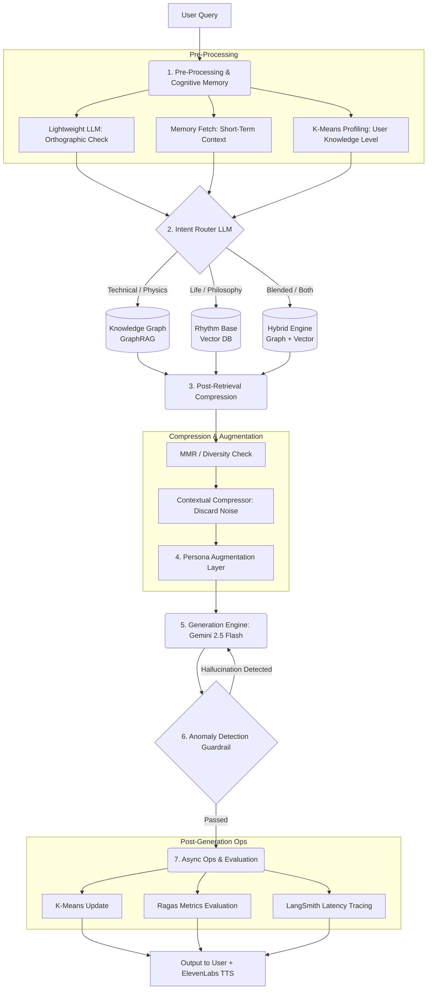
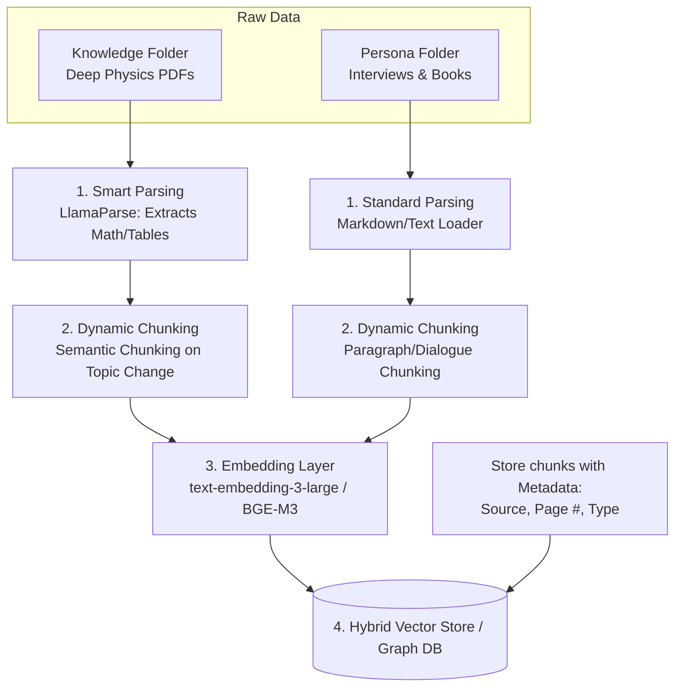

# Digital Twin RAG: Richard Feynman


An advanced Retrieval-Augmented Generation (RAG) system engineered to simulate a digital twin of Richard Feynman. By fusing his technical brilliance with his distinctive rhythm and humor, this project delivers a highly realistic, responsive, and educational AI interaction platform. 

This repository was created as part of the AIMS DTU Summer Project 2026.

---

## 🌟 Features
- **Cognitive Memory Architecture:** Dynamically profiles user knowledge utilizing K-Means and retains context with short-term buffers.
- **Tri-Retriever Engine:** Employs an intelligent intent router to query GraphRAG (for rigorous physics facts) or a Vector Rhythm Base (for persona anecdotes), or both via MMR.
- **Advanced Data Parsing:** Integrates LlamaParse for structure-aware parsing of dense physics PDFs and complex LaTeX equations.
- **Spectrogram TTS Integration:** Real-time integration with ElevenLabs to deliver authentic, synthesized voice outputs mapped to the custom frontend.
- **Industrial Sci-Fi UI:** An immersive React/Vite 3D scrollytelling frontend designed for dynamic interaction.

---

## 🏗️ System Architecture

### 1. The Core Retrieval & Generation Pipeline

This workflow illustrates how a user's query is processed, routed, retrieved, and finally generated into an authentic audio-visual response.



### 2. Smart Data Ingestion & Chunking

To handle complex 500-page academic physics PDFs and conversational transcripts accurately, the ingestion pipeline relies on advanced semantic chunking rather than blind token splits.



---

## 🚀 Quick Start

### Prerequisites
- Node.js (v18+)
- Python 3.10+
- API Keys: Gemini, ElevenLabs

### 1. Setup the Backend
```bash
cd backend
python -m venv venv
# On Windows:
.\venv\Scripts\activate
# On Mac/Linux:
# source venv/bin/activate

pip install -r requirements.txt

# Configure your environment variables
cp .env.example .env
# Edit .env and add your GEMINI_API_KEY and ELEVENLABS_API_KEY

# Run the server
uvicorn app.main:app --reload --port 8000
```

### 2. Setup the Frontend
Open a new terminal:
```bash
cd frontend
npm install
npm run dev
```
Visit `http://localhost:5173` in your browser.

---

## 🛡️ License
This project is licensed under the MIT License - see the [LICENSE](LICENSE) file for details.
