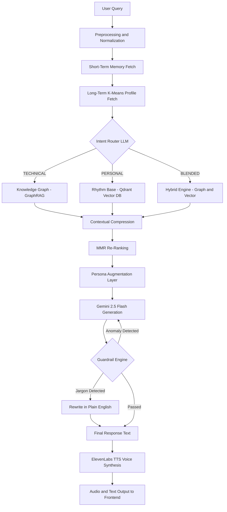
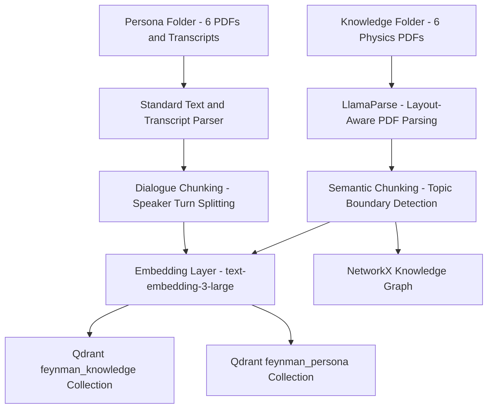

# Digital Twin of Richard Feynman

<p align="center">
  
</p>

<p align="center">
  <em>Richard Phillips Feynman (1918 - 1988), Nobel Laureate in Physics, 1965</em>
</p>

<br/>

A Retrieval-Augmented Generation system that reconstructs the intellectual and conversational identity of Richard Phillips Feynman. Unlike conventional chatbots that produce generic responses from a single language model, this system separates factual scientific knowledge from personal voice and speaking rhythm, retrieves from each independently, and fuses them under a controlled persona layer before generation. The result is an agent that does not merely answer questions about Feynman but answers them the way he would have.

This project was developed as part of the AIMS DTU Summer Research Project, 2026.

---

## Table of Contents

1. [Motivation](#motivation)
2. [What Makes This Different](#what-makes-this-different)
3. [System Architecture](#system-architecture)
4. [Data Ingestion Pipeline](#data-ingestion-pipeline)
5. [Technology Stack](#technology-stack)
6. [Repository Structure](#repository-structure)
7. [Getting Started](#getting-started)
8. [Environment Variables](#environment-variables)
9. [License](#license)

---

## Motivation

Richard Feynman was a Nobel Prize-winning theoretical physicist whose contributions span quantum electrodynamics, path integral formulation, superfluidity, and parton models. Beyond his research, he was recognized as one of the greatest science communicators of the twentieth century. His lectures at Caltech, his popular books such as *Surely You're Joking, Mr. Feynman!* and *What Do You Care What Other People Think?*, and his television interviews demonstrate a unique pedagogical style: he refused jargon, insisted on building understanding from first principles, and communicated complex physics through vivid everyday analogies.

The goal of this project is to preserve that style computationally. A digital twin, in this context, is not a chatbot trained on generic data with a system prompt overlay. It is a structured retrieval and generation pipeline where the knowledge base, the persona base, the routing logic, and the output guardrails are each engineered to ensure that every response is both scientifically grounded and stylistically authentic.

---

## What Makes This Different

| Conventional Chatbot | This Digital Twin |
|---|---|
| Single LLM with a persona prompt | Dual-store architecture separating facts from voice |
| Flat vector search over all documents | Intent-routed tri-retrieval with GraphRAG, Vector DB, and Hybrid MMR |
| No memory across sessions | K-Means long-term memory profiling across sessions |
| No output validation | Anomaly detection guardrail and jargon filtering |
| Text-only output | Integrated text-to-speech with ElevenLabs voice synthesis |

---

## System Architecture

The following diagram illustrates the end-to-end pipeline from user input to audio output. Each stage is implemented as a discrete module in the backend.



### Stage-by-Stage Breakdown

**Preprocessing.** The raw user message is normalized: whitespace is collapsed, common misspellings of domain terms (e.g., "Feynmann", "q e d") are corrected, and the cleaned string is passed downstream.

**Memory Fetch.** Two memory systems contribute context. The short-term buffer holds the last five conversation turns for pronoun resolution and follow-up handling. The long-term memory module clusters all historical user query embeddings using K-Means and infers a knowledge level (beginner, intermediate, or expert) that adjusts the generation prompt.

**Intent Router.** A lightweight Gemini model (gemini-2.0-flash-lite) classifies the query into one of three categories: TECHNICAL (physics, equations, factual explanations), PERSONAL (life stories, opinions, philosophy), or BLENDED (questions requiring both). A deterministic heuristic fallback ensures classification even when the LLM is unavailable.

**Tri-Retriever Engine.** Based on the classified intent, one of three retrieval paths is activated:

- **Technical Path.** Queries a NetworkX-backed Knowledge Graph (GraphRAG) for concept nodes, their summaries, and related edges. Simultaneously searches the Qdrant vector database over the knowledge collection. Results are merged and compressed.
- **Personal Path.** Searches the Qdrant persona collection for semantically similar speech fragments, interview excerpts, and book passages. Falls back to a local text search over transcript files when the vector database is unavailable.
- **Hybrid Path.** Fires both the technical and personal retrievers concurrently using asyncio. Pins the top result from each, then applies Maximal Marginal Relevance (MMR) re-ranking across remaining candidates to ensure diversity and eliminate redundancy in the context window.

**Contextual Compression.** Retrieved chunks are compressed by extracting only the sentences most relevant to the query. This removes noise and ensures the generation model receives focused, high-signal context.

**Persona Augmentation.** Before generation, one to two examples of Feynman's actual speech patterns from the Rhythm Base are appended to the system prompt as few-shot style guidance. These examples are never quoted verbatim in the output; they serve solely to calibrate tone, cadence, and vocabulary.

**Generation Engine.** Gemini 2.5 Flash synthesizes the final response using a system prompt that includes the Feynman identity rules, the user's knowledge profile, the retrieved knowledge context, the persona style examples, and the recent conversation history.

**Guardrail Engine.** The generated output passes through two safety checks:
- Anomaly Detection: The response embedding is compared against a baseline vocabulary embedding of Feynman's verified writing. If the cosine distance exceeds a threshold, the response is rejected and regenerated with the fallback: *"I haven't the slightest idea about that, it must be something you young folks came up with after my time."*
- Jargon Filtering: Each sentence is scanned for corporate jargon (e.g., "synergy", "leverage", "utilize"). Flagged sentences are rewritten by an LLM into plain, first-year college English consistent with Feynman's communication style.

**Voice Synthesis.** The final text is sent to ElevenLabs via their text-to-speech API. The system uses a configured voice profile with tuned stability, similarity boost, and style parameters. The resulting MP3 audio is cached on disk and served alongside the text response.

---

## Data Ingestion Pipeline

The ingestion system processes raw source documents into structured, searchable chunks stored in the vector database and knowledge graph.



**Knowledge Parsing.** Dense physics PDFs (including *The Feynman Lectures on Physics*, Volumes I through III) are parsed using LlamaParse, an AI-native document parser that understands multi-column academic layouts, mathematical equations, and table structures. Equations are converted to clean LaTeX format. When LlamaParse is unavailable, the system falls back to PyPDF extraction.

**Persona Parsing.** Conversational sources (*Surely You're Joking*, interview transcripts, YouTube transcripts) are loaded with standard text parsers. Each file is tagged with metadata including source name, document type, and format.

**Semantic Chunking.** Knowledge text is split using embedding-based topic boundary detection. Adjacent sentences are embedded, and a split is placed only when the cosine similarity between consecutive sentence vectors drops below a threshold, indicating a topic change. This ensures that coherent explanations (e.g., an entire sub-chapter on the double-slit experiment) remain in a single chunk.

**Dialogue Chunking.** Persona text is split at paragraph boundaries or speaker turns using regex-based detection. This preserves Feynman's complete thought patterns, from premise setup to punchline, within each chunk.

---

## Technology Stack

| Layer | Technology |
|---|---|
| Generation Model | Gemini 2.5 Flash |
| Intent Classification | Gemini 2.0 Flash Lite |
| Embedding Model | text-embedding-3-large (3072 dimensions) |
| Vector Database | Qdrant |
| Knowledge Graph | NetworkX (GraphRAG) |
| Document Parsing | LlamaParse, PyPDF |
| Clustering | scikit-learn K-Means |
| Voice Synthesis | ElevenLabs Text-to-Speech API |
| Backend Framework | FastAPI, Uvicorn |
| Frontend Framework | React, Vite |
| Language | Python 3.10+, JavaScript |

---

## Repository Structure

```
Digital_Twin_Rag/
    Knowledge/                   Physics PDFs (Feynman Lectures, research papers)
    Persona/                     Books, interview transcripts, YouTube transcripts
    backend/
        app/
            config.py            Central configuration and environment loading
            main.py              FastAPI application entry point
            core/
                orchestrator.py  End-to-end pipeline coordination
                intent_router.py Intent classification (TECHNICAL/PERSONAL/BLENDED)
                retrievers.py    Tri-Retriever Engine (GraphRAG, Vector, Hybrid MMR)
                knowledge_graph.py  NetworkX-backed concept graph
                context.py       Contextual compression of retrieved chunks
                generation.py    Gemini generation with persona augmentation
                guardrails.py    Anomaly detection and jargon filtering
                memory.py        Short-term buffer and K-Means long-term profiling
                preprocessing.py Input normalization and spelling correction
                tts.py           ElevenLabs and custom TTS integration
                embeddings.py    Embedding service abstraction
            pipeline/
                ingest.py        Document parsing and semantic/dialogue chunking
                embed.py         Embedding and Qdrant upsert operations
            routers/
                chat.py          REST API endpoint for chat interactions
        data/                    Runtime data (LTM profiles, audio cache)
    frontend/
        src/
            App.jsx              Main application shell
            components/          Chat interface, avatar, audio player, timeline
            hooks/               Chat state management, scroll behavior
            api/                 Backend API integration
```

---

## Getting Started

### Prerequisites

- Python 3.10 or higher
- Node.js 18 or higher
- A Gemini API key (required for generation and intent routing)
- An ElevenLabs API key (required for voice synthesis)

### Backend Setup

```bash
cd backend
python -m venv venv

# Windows
.\venv\Scripts\activate

# macOS / Linux
source venv/bin/activate

pip install -r requirements.txt
cp .env.example .env
# Edit .env with your API keys (see Environment Variables below)

uvicorn app.main:app --reload --port 8000
```

### Frontend Setup

In a separate terminal:

```bash
cd frontend
npm install
npm run dev
```

The application will be available at `http://localhost:5173`.

---

## Environment Variables

Create a `.env` file in the `backend/` directory with the following configuration:

| Variable | Description | Required |
|---|---|---|
| GEMINI_API_KEY | Google Gemini API key for generation and routing. Use a comma-separated list to enable rotating keys. | Yes |
| ELEVENLABS_API_KEY | ElevenLabs API key for voice synthesis | Yes |
| ELEVENLABS_VOICE_ID | Voice profile identifier from ElevenLabs | Yes |
| LLAMA_PARSE_API_KEY | LlamaParse key for advanced PDF parsing | Optional |
| QDRANT_URL | Qdrant server URL, default http://localhost:6333 | Optional |
| ENABLE_TTS | Enable or disable voice synthesis, default false | Optional |

---

## License

This project is licensed under the MIT License. See the [LICENSE](LICENSE) file for the complete terms.
